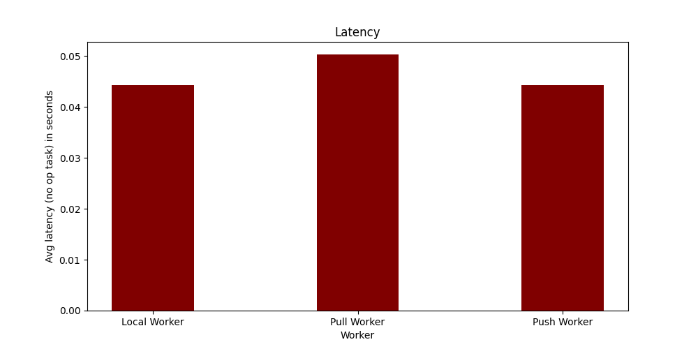
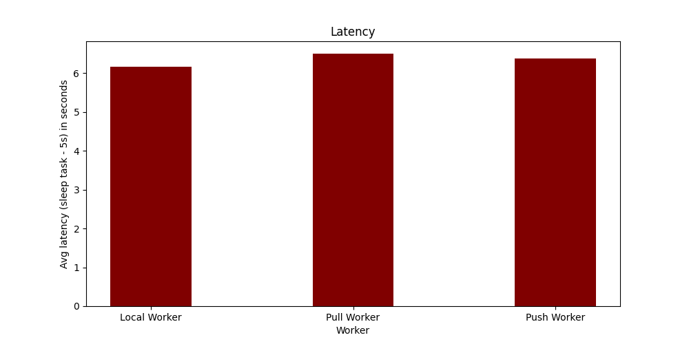
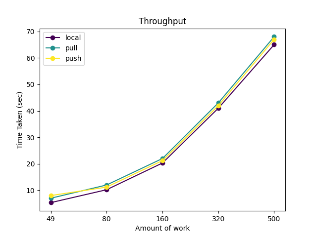
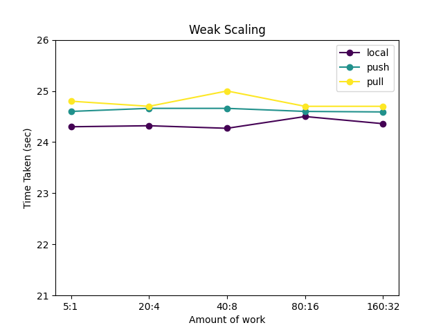
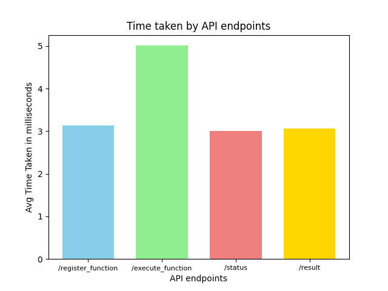

# Performance Report
Used test_client.py for the calculations.

## Latency

Avg Latency for No-op tasks with 40 workers and 500 tasks



Avg Latency for sleep tasks with 40 workers and 120 tasks



## Throughput

To measure `throughput` as a performance measure, 

Num of Active Workers:

`40 workers` active in each case of `pull`, `push`, `local`.

Tasks:

The tasks provided to execute :
```
def func_sleep(x, y):
    import time

    time.sleep(5)
    return x + y
```

The number of tasks are increased keeping the num of workers constant. 

Notes: Every function takes 5sec (sleep(5))

`Expected Time for 40 tasks = (40 * 5)/20 = 5`



As expected the time taken for tasks should increase with the num of tasks.


## Weak Scaling

To measure `weak scaling` as a performance measure, 

Num of workers and Tasks:

The num of workers and total number of tasks are increased proportionally. 

 `5 tasks - 1 worker` -> `20 tasks - 4 worker` -> `40 tasks - 8 worker`

Each task is as follows:
```
def func_sleep(x, y):
    import time

    time.sleep(5)
    return x + y
```



As expected the time taken is constant as we increase num of tasks and workers proportionally.

## API Response Endpoint

The time taken by each API endpoint is averaged over 100 tasks.


