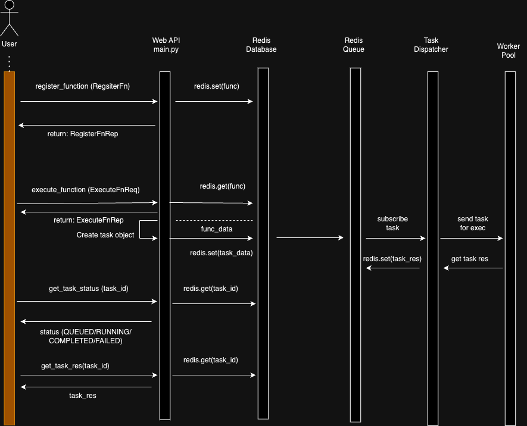

# Technical Report for MPCSFaaS Project

## 1. Introduction

- Brief overview of the Function-as-a-Service (FaaS) platform (MPCSFaaS)

  - MPCSFaaS consists of two main components: the MPCSFaaS service (exposing a REST API with Redis database and task dispatcher) and the worker pool. 
  - The MPCSFaaS service will receive HTTP requests from users, parse the requests, and perform actions. 
  - For example, it will register functions (stored in Redis) and forward them for execution on available workers in the worker pool via the task dispatcher. 
  - The worker pool will receive requests from the MPCSFaaS service, execute the requested function, and return the result back to the MPCSFaaS service to be stored in Redis until the user retrieves the function result.
  - Purpose of the technical report
  - The goal of this report is to provide the detailed implementation of the technqiues and skills used in the project.

## 2. Implementation Details 

### 2.1 REST API

- Overview of API endpoints for registering functions, executing functions, checking task status, and fetching results
  MPCSFaaS has 4 API, all created using FastAPI:

- register_func : The API call takes serialised func_body and name and stores the func_data in redis. A func_id (UUID) is returned to the client.

  ```
  def register_fn(reg_fn: RegisterFn) -> RegisterFnRep
  ```

- execute_func : The API call gets the func_data from redis based on the `func_id` and creates a task object as below
and stores this task_data in redis and returns task_id (UUID) to client. The task is then published by redis, to be subscribed by task dispatcher.

  ```
  task = {
    "fn_name": fn_name,
    "fn_body": fn_body,
    "param_payload": fn_payload,
    "status": "QUEUED",
    "result": utils.serialize("NA"),
  }
  ```

  ```
  def execute_fn(exc_fn: ExecuteFnReq) -> ExecuteFnRep
  ```

- get_task_status : This API call takes the task_id and get the task from redis, and returns the status from the task value.
  ```
  def get_task_status(task_id: uuid.UUID) -> TaskStatusRep
  ```

- get_task_results: This API call takes the task_id and get the task from redis, and returns the result from the task value.
  ```
  def get_task_results(task_id: uuid.UUID) -> TaskResultRep
  ```

## high level design:

1. **Register function**
<pre>
                     Http request                      Store data as string
User            ---------------------> FaaS service  ----------------------> redis 
                <--------------------                <--------------------- 
                   Return func UUID                  Return func UUID
                                              
(serialise                                    
data using dill)

</pre>

2. **Executing function**

<pre>


                                                                              Worker Pool
                                                                                    ^
                                                                                    |
                                                                                    |
                                                                                Task Dispatcher
                                                                                    |^
                                                                       subscribe    || Redis.pubsub with 
                                                                        to task     || task_id
     Http request with UUID + i/p arg             Look up func                      V|
User------------------------------> FaaS service----------------------------> redis(store task as queued)
    <------------------------------           |     <----------------------------   ^
                   Return func UUID           |            Return func body         | Store payload
                                              |                                     | on redis(task 
(serialise                                    |                                     | id,fn,payload,
data using dill)                              |__ Compose a task ___________________| parampayload).
                                                 with unique task UUID
                                               via Task Dispatcher
                                              
</pre>



## Error handling mechanisms and HTTP error codes

The following error codes are implemented in server for error handling

- If registeration of function fails:
  
  `HTTPException(status_code=500, detail="Function registration failed")`

- If `func_id` not found in redis, exuction function raise error 
  
  `raise HTTPException(status_code=404, detail=f"Function with {exc_fn.function_id} not found")`

- If execution function fails:
  
  `raise HTTPException(status_code=500, detail="Function execution failed")`

- For `get_task_status` and `get_task_result` if the corresponding `task_id` is not found.
  
  `raise HTTPException(status_code=404, detail=f"Task with {task_id} not found")`

### 3.2 Task Dispatcher Implementation

The task dispatcher is subscribing to channel `tasks` for `main` to publish tasks. The tasks are then divided in the worker pool based on push/pull implementation.

**1. Local Worker**

  - Local Processors are used as workers here.

    ```
    python3 task_dispatcher.py -m local -p <port> -w <num_worker_processors>
    ```

**2. Pull Implementation**

- In this case we are using `ZMQ REP/REQ` sockets, task dispatcher being the `REP`.
  ```
  python3 task_dispatcher.py -m pull -p <port>
  ```

- The task dispatcher when receives a `req` task request sends the task to the worker, and update the task status from `QUEUED` to `RUNNING`.

- The task dispatcher when receives a `res` task request updates the task res on redis, and status is updated to `COMPLETED`/`FAILED` based on func execution.

**3. Push Implementation**

- In this case we are using `ZMQ ROUTER/DEALER` sockets, task dispatcher being the `ROUTER`.
  ```
  python3 task_dispatcher.py -m push -p <port>
  ```
- When a worker starts, it sends a message with tag `reg`, to register itself and its workers at the task dispatcher. The task dispatcher maintains a `heap` with key and `curr num of work processors available` as value. So that when the task dispatcher is pushing tasks, the tasks are pushed only to those workers with available processes.

- When worker is finished a message with tag  `res` is sent (result received using `poll`), and the res is then updated to redis, and the `num of available processors` is increased. This heap also helps in load balancing the work, i.e, more tasks given to worker with more processes.

- The task is pushed on the workers in the order of number of available processes, i.e, one with the most number of processes with get the task. For this we use the `max heap` and pop the top element of the heap to assign task.

---
### 3.3 Worker Implementation

- pull worker implemenetation : Implemented using `ZMQ REP/REQ` sockets, worker being the `REQ`.
  ```
  python3 pull_worker.py <num_processes> <dispatch_url>
  ```
  - In case of pull implementation, the worker pull the task from task dispatcher, and gives the task to one of its processes. Here we are using `futures` for executing tasks. Once the task is completed `futures` execute `add_done_callback` which sends the result back to task dispatcher. The result is sent with a tag `res` attatched to it.
  - We use a lock when the processors send the result back to the task dispatcher. This ensures that multiple processors wanting to send the result to the task dispatcher doesn't break the REP/REQ pattern of the socket.

- push worker implemenetation : Implemented using `ZMQ ROUTER/DEALER` sockets, worker being the `DEALER`.
  ```
  python3 push_worker.py <num_processes> <dispatch_url>
  ```
  - In this case tasks are pushed on to the workers, the worker once receive tasks gives it to one of its processes for execution. Here we are using `futures` for executing tasks. Once the task is completed `futures` execute `add_done_callback` which sends the result back to task dispatcher. The result is sent with a tag `res` attatched to it.

**ProcessPoolExecutor**
  - For multiprocessing we have used concurrent.futurs.ProcessPoolExecutor to submit tasks.
  - ProcessPoolExecutor provides a convenient high-level interface, it is essentially an abstraction over manually launching processes using the multiprocessing module. 
  - Under the hood, it uses the multiprocessing.Pool class to create and manage the pool of worker processes.


## Running Redis
```
docker run -d -p 6379:6379 --name my-redis redis

docker container stop my-redis

docker container rm my-redis
```

## 4. Fault Tolerance

- To make the system fault tolerent we will need to ensure tasks that were being handled by a worker that has now died are not lost.
- First, we track the tasks assigned to each worker that have not been returned yet using a python dict.
- Second, we need to detect worker failures.
  - **Heartbeat Mechanism**
    - Workers(both push and pull) send their hearbeat (a simple send over the socket) periodically (We chose it to be 1 sec)
    - The task dispatcher maintains a python dict with most recent heartbeat timestamp for each worker.
    - A worker is considered to be dead if it misses a fixed number of back to back heartbeats (We chose this to be 5 sec)
- Once we detect a failure, we push back the tasks that we assigned to the redis queue which will then be assigned to other available workers.


## 5. Performance Evaluation

[Performance Report](./reports/performance_report.md)

## 6. Testing

[Testing Report](./reports/testing_report.md)

## 7. Challenges and Learnings
  1. Implementing concurrency with `multiprocess` posed significant challenges.
  2. Developing a method to incorporate heartbeat functionality and manage send/receive messages using a single socket presented notable difficulties.
  3. Establishing an effective approach for transmitting results from multiple processes over a single socket to the dispatcher proved to be a challenging task.
  4. Utilizing `mp.Manager` facilitated the creation of global variables, enabling the management of shared resources.
  5. This project provided an opportunity to thoroughly explore the documentation of `zmq` and `multiprocessing`.

## 8. References

- [ZMQ documentation](http://zguide.wikidot.com/lua:chapter3)
